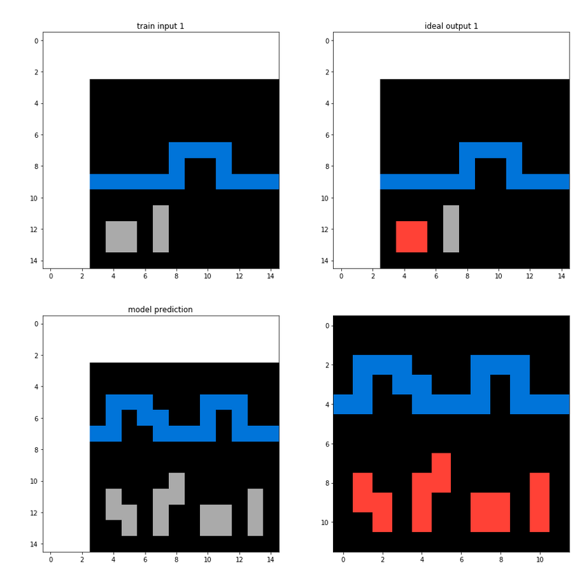

# Reptile and Transformers: A Meta learning attempt

I have been working on Abstraction and Reasoning Challenge and I came up with this approach. I hope you find this useful in some way. 
If you want to run the prediction as a kaggle kernel, you can check out [this notebook](https://www.kaggle.com/meaninglesslives/reptile-and-transformers-a-meta-learning-attempt/). 

# The challenge as I see it:
Learn a function $f(x, K) = y$, where $x$ is the input sampled from the ARC dataset, $K$ is the core knowledge prior and $y$ is the output from the ARC dataset. It should be noted that only $x$ and $K$ are the inputs here and nothing else.
For each task we already have some training examples $x$ and $y$. We can easily overfit a neural network and get 100% accuracy. But by doing so
we are not learning anything and getting nowhere closer to AGI. Even in a DSL approach, the algorithm is not learning anything! In such an approach
we have created handcrafted constraints on the type of functions i.e. we have manually engineered K. 
A smart algorithm should have a representation of cognitive priors and should automatically decide which specific
prior is suitable for a particular task. The tasks are independent of each other but they have something in common i.e. the cognitive priors.
We can use this common thread among all the tasks to learn a representation of cognitive priors. And whenever we want to do prediction on a new task, we can finetune and select our learnt priors for that task. So how to do this ?

# Meta Learning
Meta-learning is the process of learning how to learn. A meta-learning algorithm takes in a distribution of tasks, where each task is a learning problem, and it produces a quick learner — a learner that can generalize from a small number of examples. MAML is one of the famous meta-learning approaches
out there. But it requires us to compute Hessians (which is hard). Another interesting approach is the Reptile Algorithm. It's mathematically similar to first order MAML and performs a very similar update. The performance of reptile is similar to MAML
on the Omniglot and Mini-ImageNet benchmarks. So, i decided to stick with Reptile instead of MAML.

# About the code
The ARC Dataset is divided into training, evaluation and test sets. 100 examples from the evaluation set are part of the test set. I use these 100 tasks
for validation. Each task can have 3 to 5 training images and images can vary in size across and within tasks from 2x2 to 30x30.
The model weights are going to be shared among the tasks. So, we need a model that is independent of image size. So, i decided to 
make an extra class (11). This class represents non existent pixels for a task. So, let's say task size is 10, then i pad the image with class 1 such
that image size is again 15. This has two advantages (hopefully)
1. Allows us to have a common size across tasks (important if you want to experiment with cnn)
2. Introduces the concept of emptiness and varying size to our model. 
   
I experimented with cnn's but i found their performance to be lacking. In the current code, you can see that i am using transformer model.
I reshape the image and pass it to the embedding layer first, followed by a positional encoding layer to account for the order of the pixel. I 
use Pytorch's implementation of TransformerEncoder. The output of TransformerEncoder model is sent to the final Linear layer, which gives
us logits for each class (we have total 11 classes). Then we use the usual cross entropy for model training.

Since we are learning an abstract representation of cognitive priors,  during the model training we need an outer loop which iterates over all the tasks.
We train a transformer model for each task using the task specific inputs and outputs. This is our inner loop.
Then we perform a gradient update to interpolate between current model weights and trained weights from this task.
I found this picture from MAML paper very useful to get an intuition about 

1. You can use arc_transformer.py to perform training over all the tasks.
2. transformer_validation.py can be used to evaluate the performance on our validation set.
3. transformer_preds.py can be used to make predictions on the test set.

I use the Transformer model. You can easily replace the model with any cnn or deep learning model that you desire. I just wanted 
to introduce the idea of meta-learning and how it may be pertinent to the ARC dataset.

Some Model Outputs:

